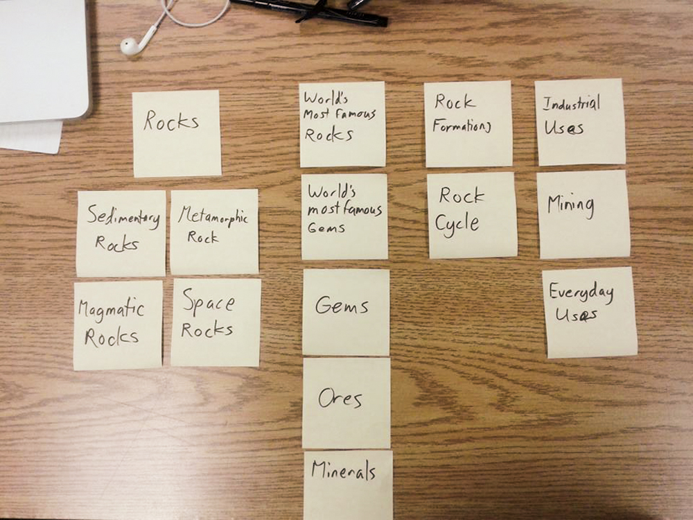
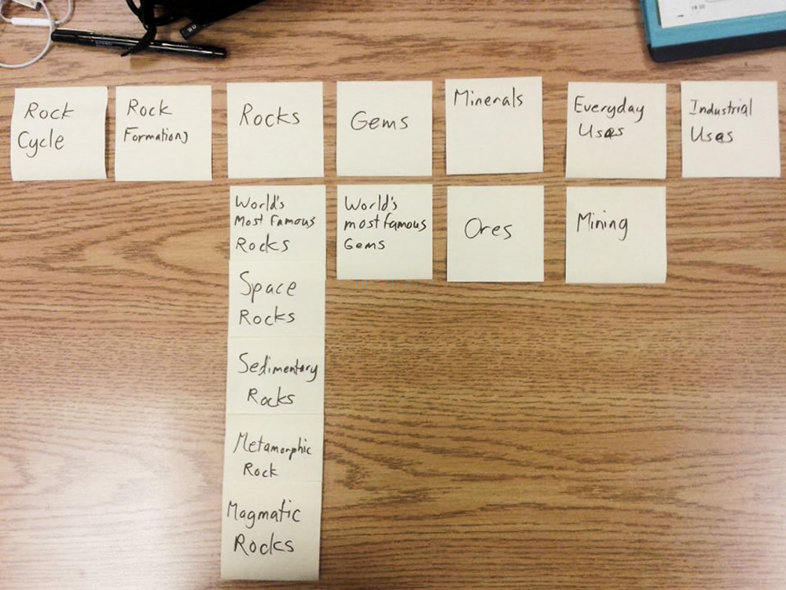

# Card sort report

The purpose of this card sort was to determine common navigation patterns and categories from the content of Rocks, Minerals, and Gemstones.

## Specifics

The card sort was conducted by Lisa Villeneuve on September 10th, 2013 between the times of 3pm and 6pm with the following participants:

- Grace Morton
- Jenny Richardson

### Cards

15 cards were used covering a broad range of applicable content for the website. The following topics were used as cards:

1. Mining
2. Industrial Uses
3. Everyday Uses
4. Gems
5. World's Most Famous Gems
6. Minerals
7. Ores
8. Rocks
9. Rock Formations
10. World's Most Famous Rocks
11. Space Rocks
12. Rock Cycle
13. Magmatic Rocks
14. Sedimentary Rocks
15. Metamorphic Rocks

## Card sort results

*Card sort 1 by Grace Morton*

*Card sort 2 by Jenny Richardson*

## Observations

- Did the participants have any common comments?  
	- They were unsure how to organize as they did not know much about the topics
- Did they have questions that stood out?
	- They asked what the difference between rock types and rock formations were.  
- Did they struggle with certain articles or topics?
	- The difference between rocks and minerals was not known by them which made organizing difficult for them
- Did they find common groupings? Or were the groupings completely different?
	- The groupings were completely different.  
- Were some of the groupings completely unexpected?
	- Some groupings were much larger than others.  
- Were the results similar to your expectations?
	- In some ways, yes, in some ways, they were mis-organized due to wild guesses
- How did you feel while watching them perform the task?
	- I realized that some categories needed more items under them.  